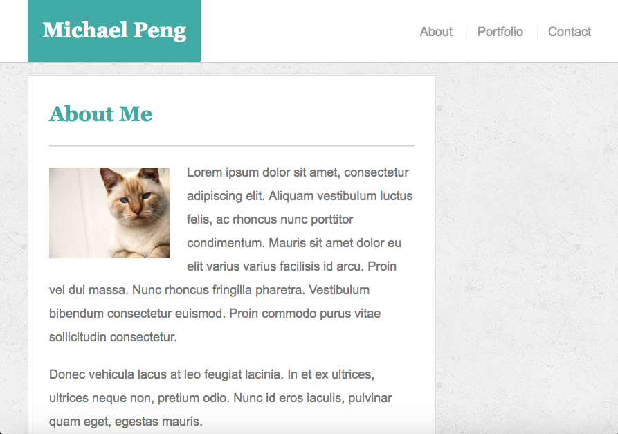

# Responsive-Portfolio

## Overview
In this homework assignment for Rutgers Coding Bootcamp, students were asked to create a sample portfolio. This was the enhancement of the portfolio I made previously with a mobile-responsive layout.

## Screenshots
About pages

Portfolio pages

Contact pages

